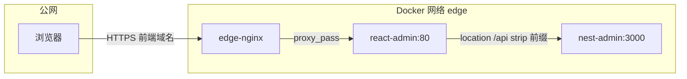
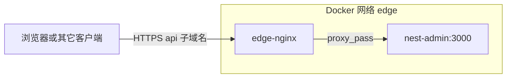

# nest-admin：Edge 迁移（nginx + certbot）与 react-admin 对接设计

**日期**：2026-05-13  
**状态**：已实现

## 1. 目标

1. 将本仓库 `deploy/edge` 从 **caddy-docker-proxy** 改为与上一级 **`react-admin/deploy/edge` 同构**的 **nginx + certbot** 栈，作为服务器共用「前台」（监听 80/443，TLS 终结，反代到接入 **`edge`** 网络的容器）。
2. **方案 1**：`react-admin` 经 **edge nginx → 前端容器 → 容器内 nginx** 将浏览器发起的 **`/api/*`** 转发到 **`nest-admin:3000`**（`BACKEND_UPSTREAM=http://nest-admin:3000`）。
3. **方案 2（叠加）**：在同一套 edge nginx 上为 **API 公网子域名**（例如 `api.example.com`）增加独立 **`server`**，直连 **`http://nest-admin:3000`**，供浏览器（需配置前端 API 基址）、脚本或其它客户端使用。

## 2. 非目标

- 不在本规格中要求改造 `react-admin` 业务代码；部署侧通过 Secret / 构建参数配置即可。
- 不保留「通过 Docker labels 由 caddy-docker-proxy 自动生成路由」作为默认路径；公网路由以 **`nginx/conf.d/` 显式配置**为准。
- 不在此规格中规定具体域名字符串（以运维环境为准）。

## 3. 架构与流量

### 3.1 方案 1（相对路径 `/api`，推荐默认）

- 与 `react-admin` 镜像内 `nginx/default.conf.template` 行为一致：`/api/foo` → `BACKEND_UPSTREAM/foo`。
- **前提**：`nest-admin` 的 API 容器 **`container_name` 为 `nest-admin`**（或与 `BACKEND_UPSTREAM` 中主机名一致），且加入 **`external` 网络 `edge`**。

### 3.2 方案 2（API 子域名）

- **前提**：edge 上增加 **`server_name` 为 API 域名** 的 `server`（HTTP-01 与 HTTPS 配置与前端域名并列维护）；`proxy_set_header` 需包含 `Host`、`X-Forwarded-Proto` 等，与前端反代一致，便于 Nest 识别 HTTPS 与原始主机。
- **跨域**：若浏览器页面托管在**前端域名**而 XHR 指向 **API 子域名**，则为跨域。当前 `nest-admin` 在 `main.ts` 中**未启用 CORS**。**实现阶段**需在 Nest 生产环境为 API 子域名场景开启 CORS，允许来源至少包含前端页面源（建议用配置项驱动，例如基于现有 `APP_FRONTEND_URL` 或新增 `CORS_ORIGINS`，以逗号分隔多源）。

## 4. 仓库内交付物（实现清单）

### 4.1 `deploy/edge`

- 用 **`react-admin/deploy/edge`** 为蓝本，替换本仓库现有 Caddy 版 edge：
  - `docker-compose.yml`（nginx + certbot、命名网络 **`edge`**、卷挂载模式一致）。
  - `nginx/conf.d/`：保留与 react-admin 对齐的**前端**示例（可命名为 `react-admin.conf` / `react-admin.conf.https.example` 或等效命名）；**新增** `nest-admin-api.conf`（及对应的 `.https.example`），内容包含：
    - **仅 HTTP** 阶段：`listen 80`、`server_name <API 域名>`、`/.well-known/acme-challenge/`、`proxy_pass http://nest-admin:3000`（或签发前仅 ACME，业务 `location /` 可在证书就绪后启用，与 react-admin README 流程一致）。
    - **HTTPS 阶段**：`443 ssl`、`proxy_pass http://nest-admin:3000`、标准头与 WebSocket/SSE 相关头（与前端 conf 的 `map $http_upgrade` 模式一致）。
  - `scripts/`、`.env.example`、`README.md`：与 react-admin 同级说明对齐，并**补充**：
    - 双域名时 **certbot** 可申请 **SAN 证书**（`-d` 多个域名）或**分别申请**两套证书；需在文档中写明两种做法及 nginx 中 `ssl_certificate` 路径对应关系。
    - 明确 **一台服务器只运行一份 edge**，避免重复占用 80/443。

### 4.2 根目录 Compose 与 Caddy 叠加层

- **`docker-compose.yml`**：维持 `api` + `mysql` + `redis` 与 **`edge` / `internal`** 网络；**删除或废弃** `docker-compose.caddy.yml` 及文档中「通过 labels + caddy-docker-proxy 暴露 API」的推荐路径，避免与 nginx edge 双轨。
- 若仓库内仍暂留 `docker-compose.caddy.yml` 文件，须在 README 中标注 **deprecated**，并指向 edge nginx 配置方式。

### 4.3 `.github/workflows/deploy.yml`

- **对齐 `react-admin` 风格**：job/步骤命名、Buildx、登录、metadata、GHA cache、`scp` 与 SSH 结构。
- **`scp`**：仅上传服务器运行所需的 compose 文件（**不再**上传 `docker-compose.caddy.yml`）；上传列表与 `DEPLOY_PATH` 约定写进注释。
- **远端 `.env`**：
  - 继续通过 **`APP_ENV`**（多行 Secret）写入应用密钥与数据库等（nest 无法用三行 heredoc 替代）。
  - **移除** 与 `SSL_DOMAIN`、`COMPOSE_FILE` 叠加 caddy 相关的注入逻辑。
  - 保留 **`DOCKER_IMAGE`** 注入；可选保留 **`umask 077`** 与 CRLF 剔除等与安全/健壮性相关的处理。
- **部署命令**：与 react-admin 对齐 **`docker compose pull` + `up -d --remove-orphans`**；是否保留 **`--wait`** 与失败时 **`logs`** 由实现计划权衡（推荐保留以提高可观测性，与 react-admin 差异在注释中说明原因）。

### 4.4 `README.md`（部署章节）

- 说明与 **`react-admin` 同机部署顺序**：edge → `nest-admin` → `react-admin`。
- **方案 1**：`react-admin` 部署 Secret **`BACKEND_UPSTREAM=http://nest-admin:3000`**。
- **方案 2**：edge 增加 API 域名 `server`；Nest **CORS** 与前端 **API 基址**配置要求。

## 5. Secrets / 环境变量（运维约定）

| 用途 | 说明 |
|------|------|
| `react-admin` CI | `BACKEND_UPSTREAM=http://nest-admin:3000`（方案 1） |
| `nest-admin` CI | `APP_ENV` 含 `MYSQL_*`、`AUTH_ACCESS_TOKEN_SECRET`、`APP_FRONTEND_URL`、`SMTP_*` 等；**`APP_FRONTEND_URL` 应为浏览器访问的前端源**（如 `https://app.example.com`），供邮件链接等；若使用 API 子域名，CORS 来源需与该 URL 一致或可解析为列表 |
| Edge 宿主机 | 证书邮箱、域名列表；nginx `server_name` 与证书 CN/SAN 一致 |

## 6. 测试与验收

- **本地/预发**：`docker compose` 起 `nest-admin` 栈，手工 `curl` 容器内 `nest-admin:3000` 健康或已知路由。
- **联调**：从前端域名访问页面，登录/列表等走 **`/api`** 成功（方案 1）。
- **方案 2**：用 **`https://api.<域名>/...`** 直接调用 API 成功；从前端域页面若配置为调用 API 子域名，确认 **CORS** 与 Cookie（若使用）策略符合预期。

## 7. 风险与回滚

- **风险**：双域名证书配置错误导致 nginx 无法 reload；缓解为 `nginx -t` 与分步签发文档。
- **风险**：启用 API 子域名但未配 CORS 导致浏览器请求失败；缓解为实现阶段必配 CORS。
- **回滚**：保留旧 Caddy edge 的 compose 备份即可切回（不推荐长期使用双轨）。

## 8. 规格自检记录

- **占位符**：无「待定」章节；域名处使用 `<API 域名>` 等泛指，符合「不写死具体域名」约定。
- **一致性**：方案 1 与 `react-admin` 模板一致；方案 2 与 edge 显式配置一致；workflow 与废弃 caddy 叠加无矛盾。
- **范围**：单实现计划可覆盖（edge 文件替换 + workflow + README + Nest CORS 若需）。
- **歧义**：「叠加」定义为**同时支持**路径反代与子域名反代；不要求同一用户会话必须同时使用两者。
